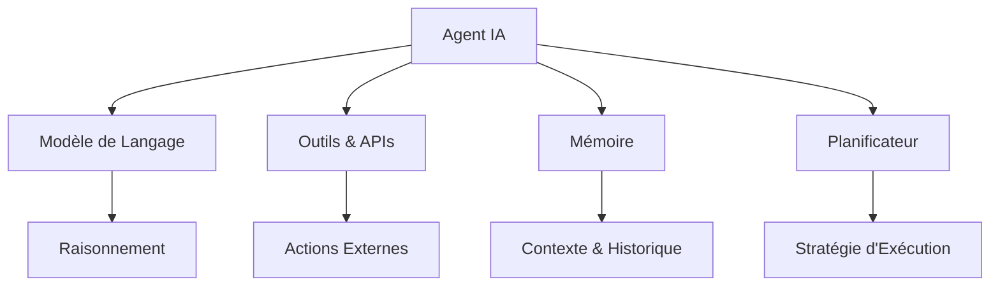
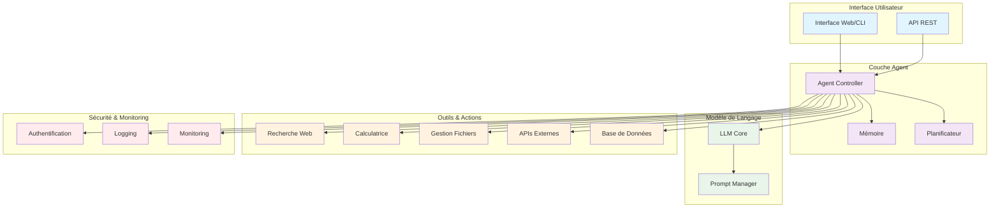

# AI Agents 2025 : Créer votre Premier Assistant IA avec LangChain

L'année 2025 marque un tournant dans l'évolution des agents IA. Ces assistants autonomes capables de raisonner, planifier et agir révolutionnent la façon dont nous interagissons avec l'intelligence artificielle. Dans ce guide complet, nous explorerons comment créer votre premier agent IA avec LangChain, depuis les concepts fondamentaux jusqu'à l'implémentation pratique.

## Qu'est-ce qu'un Agent IA ?

### Définition Simplifiée

Un **agent IA** est un système d'intelligence artificielle autonome capable de :

- **Percevoir** son environnement
- **Raisonner** sur les actions à entreprendre
- **Planifier** une séquence d'opérations
- **Agir** en utilisant des outils externes
- **Apprendre** de ses expériences

Contrairement à un chatbot traditionnel qui ne fait que répondre, un agent IA peut exécuter des tâches complexes de manière autonome.

<Callout type="info" title="Analogie Simple">
Imaginez un assistant personnel qui peut non seulement répondre à vos questions, mais aussi effectuer des actions concrètes : envoyer des emails, analyser des données, programmer des tâches, et même prendre des décisions basées sur des critères que vous avez définis.
</Callout>

### Composants Clés d'un Agent IA



## Comparaison des Frameworks : LangChain vs AutoGPT vs CrewAI

Avant de plonger dans LangChain, examinons les principaux frameworks disponibles pour créer des agents IA :

### LangChain

**Forces :**
- Écosystème mature et documenté
- Large communauté et support
- Intégration native avec de nombreux LLMs
- Flexibilité et modularité
- Outils de debug avancés

**Faiblesses :**
- Courbe d'apprentissage plus élevée
- Performance parfois impactée par l'abstraction

**Cas d'usage idéaux :**
- Applications d'entreprise complexes
- Intégrations multiples avec des APIs
- Workflows personnalisés avancés

### AutoGPT

**Forces :**
- Interface utilisateur intuitive
- Autonomie élevée "out of the box"
- Parfait pour les débutants
- Gestion automatique des tâches longues

**Faiblesses :**
- Moins de contrôle granulaire
- Coûts potentiellement élevés
- Limitations dans la personnalisation

**Cas d'usage idéaux :**
- Prototypage rapide
- Tâches de recherche autonome
- Automation simple

### CrewAI

**Forces :**
- Spécialisé dans les agents collaboratifs
- Gestion native du multi-agent
- Workflows prédéfinis efficaces
- Interface simple et claire

**Faiblesses :**
- Écosystème plus récent
- Documentation moins exhaustive
- Moins d'intégrations tierces

**Cas d'usage idéaux :**
- Équipes d'agents spécialisés
- Workflows collaboratifs
- Projets nécessitant plusieurs expertises

### Tableau Comparatif

| Critère | LangChain | AutoGPT | CrewAI |
|---------|-----------|---------|--------|
| **Facilité d'apprentissage** | ⭐⭐⭐ | ⭐⭐⭐⭐⭐ | ⭐⭐⭐⭐ |
| **Flexibilité** | ⭐⭐⭐⭐⭐ | ⭐⭐ | ⭐⭐⭐ |
| **Performance** | ⭐⭐⭐⭐ | ⭐⭐⭐ | ⭐⭐⭐⭐ |
| **Communauté** | ⭐⭐⭐⭐⭐ | ⭐⭐⭐⭐ | ⭐⭐⭐ |
| **Documentation** | ⭐⭐⭐⭐⭐ | ⭐⭐⭐ | ⭐⭐⭐ |
| **Multi-agent** | ⭐⭐⭐ | ⭐⭐ | ⭐⭐⭐⭐⭐ |

<Callout type="tip" title="Recommandation">
Pour ce tutoriel, nous utilisons LangChain car il offre le meilleur équilibre entre puissance, flexibilité et support communautaire. C'est également le framework le plus demandé en entreprise en 2025.
</Callout>

## Configuration de l'Environnement

### Prérequis

Avant de commencer, assurez-vous d'avoir :

- Python 3.9+ installé
- Un compte OpenAI avec accès API
- Connaissances de base en Python
- Un éditeur de code (VS Code recommandé)

### Installation des Dépendances

Créons un nouvel environnement virtuel et installons les packages nécessaires :

```bash
# Créer un nouvel environnement virtuel
python -m venv venv

# Activer l'environnement (Windows)
venv\Scripts\activate

# Activer l'environnement (macOS/Linux)
source venv/bin/activate

# Installer les dépendances principales
pip install langchain langchain-openai langchain-community
pip install python-dotenv requests beautifulsoup4
pip install streamlit # Pour l'interface utilisateur
```

### Configuration des Variables d'Environnement

Créez un fichier `.env` dans votre répertoire de projet :

```env
# Clés API
OPENAI_API_KEY=your_openai_api_key_here
SERPAPI_API_KEY=your_serpapi_key_here  # Pour la recherche web

# Configuration du modèle
MODEL_NAME=gpt-4-turbo-preview
TEMPERATURE=0.1
MAX_TOKENS=2000

# Configuration de l'agent
AGENT_VERBOSE=true
MAX_ITERATIONS=5
```

<Callout type="warning" title="Sécurité">
Ne jamais commiter votre fichier `.env` dans un repository public. Ajoutez-le à votre `.gitignore` pour protéger vos clés API.
</Callout>

## Tutoriel Étape par Étape : Premier Agent IA

### Étape 1 : Structure de Base

Créons la structure de base de notre agent :

```python
# agent_base.py
import os
from dotenv import load_dotenv
from langchain.agents import AgentType, initialize_agent
from langchain_openai import ChatOpenAI
from langchain.memory import ConversationBufferWindowMemory
from langchain.tools import Tool
from langchain.schema import SystemMessage

# Charger les variables d'environnement
load_dotenv()

class AIAgent:
    def __init__(self):
        self.llm = self._setup_llm()
        self.memory = self._setup_memory()
        self.tools = self._setup_tools()
        self.agent = self._create_agent()

    def _setup_llm(self):
        """Configuration du modèle de langage"""
        return ChatOpenAI(
            model_name=os.getenv("MODEL_NAME", "gpt-4-turbo-preview"),
            temperature=float(os.getenv("TEMPERATURE", 0.1)),
            max_tokens=int(os.getenv("MAX_TOKENS", 2000)),
            openai_api_key=os.getenv("OPENAI_API_KEY")
        )

    def _setup_memory(self):
        """Configuration de la mémoire conversationnelle"""
        return ConversationBufferWindowMemory(
            memory_key="chat_history",
            k=5,  # Garder les 5 derniers échanges
            return_messages=True
        )

    def _setup_tools(self):
        """Configuration des outils disponibles"""
        return []  # Nous ajouterons les outils dans les prochaines étapes

    def _create_agent(self):
        """Création de l'agent avec ses outils et sa mémoire"""
        system_message = SystemMessage(content="""
        Tu es un assistant IA intelligent et serviable. Tu peux :
        - Répondre aux questions
        - Utiliser des outils pour accomplir des tâches
        - Planifier des actions complexes
        - Apprendre de tes interactions

        Sois toujours précis, utile et transparent sur tes actions.
        """)

        return initialize_agent(
            tools=self.tools,
            llm=self.llm,
            agent=AgentType.CHAT_CONVERSATIONAL_REACT_DESCRIPTION,
            memory=self.memory,
            verbose=os.getenv("AGENT_VERBOSE", "true").lower() == "true",
            max_iterations=int(os.getenv("MAX_ITERATIONS", 5)),
            agent_kwargs={
                "system_message": system_message
            }
        )

    def run(self, query: str):
        """Exécuter une requête"""
        try:
            response = self.agent.run(query)
            return response
        except Exception as e:
            return f"Erreur lors de l'exécution : {str(e)}"

# Test de base
if __name__ == "__main__":
    agent = AIAgent()
    print("Agent IA initialisé avec succès !")

    # Test simple
    response = agent.run("Bonjour, peux-tu te présenter ?")
    print(f"Réponse : {response}")
```

### Étape 2 : Ajout des Outils

Maintenant, ajoutons des outils pour rendre notre agent capable d'actions concrètes :

```python
# tools.py
import requests
from bs4 import BeautifulSoup
from datetime import datetime
import json
from langchain.tools import Tool

class AgentTools:
    """Collection d'outils pour notre agent IA"""

    @staticmethod
    def search_web(query: str) -> str:
        """Recherche sur le web via SerpAPI"""
        api_key = os.getenv("SERPAPI_API_KEY")
        if not api_key:
            return "Clé SerpAPI non configurée"

        try:
            url = f"https://serpapi.com/search.json"
            params = {
                "q": query,
                "api_key": api_key,
                "engine": "google",
                "num": 5
            }

            response = requests.get(url, params=params)
            data = response.json()

            results = []
            for result in data.get("organic_results", [])[:3]:
                results.append(f"Titre: {result.get('title')}\nURL: {result.get('link')}\nDescription: {result.get('snippet')}\n")

            return "\n".join(results) if results else "Aucun résultat trouvé"

        except Exception as e:
            return f"Erreur lors de la recherche : {str(e)}"

    @staticmethod
    def get_current_time() -> str:
        """Obtenir l'heure actuelle"""
        return datetime.now().strftime("%Y-%m-%d %H:%M:%S")

    @staticmethod
    def calculate(expression: str) -> str:
        """Calculatrice simple et sécurisée"""
        try:
            # Sécurisation : ne permettre que les opérations mathématiques de base
            allowed_chars = "0123456789+-*/.() "
            if not all(c in allowed_chars for c in expression):
                return "Expression non autorisée"

            result = eval(expression)
            return str(result)
        except Exception as e:
            return f"Erreur de calcul : {str(e)}"

    @staticmethod
    def save_to_file(filename: str, content: str) -> str:
        """Sauvegarder du contenu dans un fichier"""
        try:
            with open(f"outputs/{filename}", "w", encoding="utf-8") as f:
                f.write(content)
            return f"Contenu sauvegardé dans outputs/{filename}"
        except Exception as e:
            return f"Erreur lors de la sauvegarde : {str(e)}"

    @staticmethod
    def read_from_file(filename: str) -> str:
        """Lire le contenu d'un fichier"""
        try:
            with open(f"outputs/{filename}", "r", encoding="utf-8") as f:
                content = f.read()
            return content
        except FileNotFoundError:
            return "Fichier non trouvé"
        except Exception as e:
            return f"Erreur lors de la lecture : {str(e)}"

    @classmethod
    def get_tools_list(cls):
        """Retourne la liste des outils formatés pour LangChain"""
        return [
            Tool(
                name="recherche_web",
                description="Recherche d'informations sur le web. Utilise ce tool quand tu as besoin d'informations récentes ou spécifiques. Input: requête de recherche",
                func=cls.search_web
            ),
            Tool(
                name="heure_actuelle",
                description="Obtient l'heure et la date actuelles. Utilise ce tool quand on te demande l'heure. Input: pas d'input nécessaire, utilise 'now'",
                func=lambda _: cls.get_current_time()
            ),
            Tool(
                name="calculatrice",
                description="Effectue des calculs mathématiques. Utilise ce tool pour résoudre des problèmes de mathématiques. Input: expression mathématique",
                func=cls.calculate
            ),
            Tool(
                name="sauvegarder_fichier",
                description="Sauvegarde du contenu dans un fichier. Format input: 'nom_fichier.txt|contenu à sauvegarder'",
                func=lambda input_str: cls.save_to_file(*input_str.split("|", 1))
            ),
            Tool(
                name="lire_fichier",
                description="Lit le contenu d'un fichier sauvegardé. Input: nom du fichier",
                func=cls.read_from_file
            )
        ]
```

### Étape 3 : Agent Complet avec Outils

Mettons à jour notre classe principale pour intégrer les outils :

```python
# agent_complete.py
import os
from dotenv import load_dotenv
from langchain.agents import AgentType, initialize_agent
from langchain_openai import ChatOpenAI
from langchain.memory import ConversationBufferWindowMemory
from langchain.schema import SystemMessage
from tools import AgentTools

# Charger les variables d'environnement
load_dotenv()

# Créer le dossier outputs s'il n'existe pas
os.makedirs("outputs", exist_ok=True)

class SmartAIAgent:
    def __init__(self):
        self.llm = self._setup_llm()
        self.memory = self._setup_memory()
        self.tools = AgentTools.get_tools_list()
        self.agent = self._create_agent()
        self.conversation_history = []

    def _setup_llm(self):
        """Configuration du modèle de langage"""
        return ChatOpenAI(
            model_name=os.getenv("MODEL_NAME", "gpt-4-turbo-preview"),
            temperature=float(os.getenv("TEMPERATURE", 0.1)),
            max_tokens=int(os.getenv("MAX_TOKENS", 2000)),
            openai_api_key=os.getenv("OPENAI_API_KEY")
        )

    def _setup_memory(self):
        """Configuration de la mémoire conversationnelle"""
        return ConversationBufferWindowMemory(
            memory_key="chat_history",
            k=10,  # Garder les 10 derniers échanges
            return_messages=True
        )

    def _create_agent(self):
        """Création de l'agent avec ses outils et sa mémoire"""
        system_message = SystemMessage(content="""
        Tu es un assistant IA intelligent et polyvalent nommé AI4Dev Assistant.

        CAPACITÉS:
        - Recherche d'informations en temps réel sur le web
        - Calculs mathématiques précis
        - Gestion de fichiers (lecture/écriture)
        - Connaissance de l'heure actuelle
        - Mémorisation des conversations

        COMPORTEMENT:
        - Sois toujours précis et factuel
        - Utilise tes outils quand nécessaire
        - Explique tes actions clairement
        - Pose des questions de clarification si nécessaire
        - Structure tes réponses de manière claire

        PROCESSUS DE DÉCISION:
        1. Analyse la demande de l'utilisateur
        2. Détermine quels outils utiliser
        3. Execute les actions nécessaires
        4. Synthétise les résultats
        5. Réponds de manière structurée
        """)

        return initialize_agent(
            tools=self.tools,
            llm=self.llm,
            agent=AgentType.CHAT_CONVERSATIONAL_REACT_DESCRIPTION,
            memory=self.memory,
            verbose=os.getenv("AGENT_VERBOSE", "true").lower() == "true",
            max_iterations=int(os.getenv("MAX_ITERATIONS", 5)),
            agent_kwargs={
                "system_message": system_message
            }
        )

    def run(self, query: str):
        """Exécuter une requête avec gestion d'historique"""
        try:
            print(f"\n🤖 Traitement de votre demande : {query}")
            print("=" * 50)

            response = self.agent.run(query)

            # Sauvegarder dans l'historique
            self.conversation_history.append({
                "timestamp": AgentTools.get_current_time(),
                "query": query,
                "response": response
            })

            return response

        except Exception as e:
            error_msg = f"Erreur lors de l'exécution : {str(e)}"
            print(f"❌ {error_msg}")
            return error_msg

    def get_conversation_summary(self):
        """Obtenir un résumé de la conversation"""
        if not self.conversation_history:
            return "Aucune conversation en cours."

        summary = f"Résumé de la conversation ({len(self.conversation_history)} échanges):\n"
        for i, exchange in enumerate(self.conversation_history[-5:], 1):
            summary += f"{i}. {exchange['timestamp']} - Q: {exchange['query'][:50]}...\n"

        return summary

# Interface de test
def main():
    print("🚀 Initialisation de l'Agent IA...")
    agent = SmartAIAgent()
    print("✅ Agent IA prêt !\n")

    # Exemples de tests
    test_queries = [
        "Quelle heure est-il ?",
        "Calcule 15 * 23 + 157",
        "Recherche les dernières nouvelles sur l'IA en 2025",
        "Sauvegarde le résultat de ma recherche dans un fichier 'news_ia.txt'",
        "Lis le contenu du fichier 'news_ia.txt'"
    ]

    print("🧪 Tests automatiques :")
    for query in test_queries:
        response = agent.run(query)
        print(f"\n📝 Réponse :\n{response}\n")
        print("-" * 80)

    # Mode interactif
    print("\n💬 Mode interactif (tapez 'quit' pour quitter) :")
    while True:
        user_input = input("\n👤 Votre question : ")
        if user_input.lower() in ['quit', 'exit', 'quitter']:
            print("\n👋 Au revoir !")
            break

        response = agent.run(user_input)
        print(f"\n🤖 Réponse :\n{response}")

if __name__ == "__main__":
    main()
```

<Callout type="tip" title="Test de Performance">
Pour tester les performances de votre agent, mesurez le temps de réponse pour différents types de requêtes. Un bon agent devrait répondre en moins de 10 secondes pour la plupart des tâches simples.
</Callout>

## Cas d'Usage Concrets

### 1. Agent de Support Client

Créons un agent spécialisé dans le support client :

```python
# customer_support_agent.py
from langchain.schema import SystemMessage
from langchain.tools import Tool
import json

class CustomerSupportAgent(SmartAIAgent):
    def __init__(self, knowledge_base_path="customer_kb.json"):
        super().__init__()
        self.knowledge_base = self._load_knowledge_base(knowledge_base_path)
        self.tools.extend(self._get_support_tools())
        self.agent = self._create_support_agent()

    def _load_knowledge_base(self, path):
        """Charger la base de connaissances"""
        try:
            with open(path, 'r', encoding='utf-8') as f:
                return json.load(f)
        except FileNotFoundError:
            # Base de connaissances par défaut
            default_kb = {
                "faq": [
                    {
                        "question": "Comment réinitialiser mon mot de passe ?",
                        "answer": "Cliquez sur 'Mot de passe oublié' sur la page de connexion et suivez les instructions."
                    },
                    {
                        "question": "Comment contacter le support ?",
                        "answer": "Vous pouvez nous contacter par email à support@example.com ou par téléphone au 01 23 45 67 89."
                    }
                ],
                "products": [
                    {
                        "name": "Product A",
                        "description": "Description du produit A",
                        "price": "99€"
                    }
                ]
            }
            # Sauvegarder la base par défaut
            with open(path, 'w', encoding='utf-8') as f:
                json.dump(default_kb, f, indent=2, ensure_ascii=False)
            return default_kb

    def _search_knowledge_base(self, query: str) -> str:
        """Rechercher dans la base de connaissances"""
        query_lower = query.lower()
        results = []

        # Recherche dans les FAQ
        for faq in self.knowledge_base.get("faq", []):
            if any(word in faq["question"].lower() for word in query_lower.split()):
                results.append(f"FAQ: {faq['question']}\nRéponse: {faq['answer']}")

        # Recherche dans les produits
        for product in self.knowledge_base.get("products", []):
            if any(word in product["name"].lower() for word in query_lower.split()):
                results.append(f"Produit: {product['name']}\nDescription: {product['description']}\nPrix: {product['price']}")

        return "\n\n".join(results) if results else "Aucune information trouvée dans la base de connaissances."

    def _create_ticket(self, issue_description: str) -> str:
        """Créer un ticket de support"""
        ticket_id = f"TICKET-{datetime.now().strftime('%Y%m%d%H%M%S')}"
        ticket_data = {
            "id": ticket_id,
            "description": issue_description,
            "status": "ouvert",
            "created_at": AgentTools.get_current_time(),
            "priority": "normale"
        }

        # Sauvegarder le ticket
        try:
            tickets_file = "outputs/support_tickets.json"
            if os.path.exists(tickets_file):
                with open(tickets_file, 'r', encoding='utf-8') as f:
                    tickets = json.load(f)
            else:
                tickets = []

            tickets.append(ticket_data)

            with open(tickets_file, 'w', encoding='utf-8') as f:
                json.dump(tickets, f, indent=2, ensure_ascii=False)

            return f"Ticket créé avec succès. ID: {ticket_id}. Nous vous contacterons sous 24h."

        except Exception as e:
            return f"Erreur lors de la création du ticket : {str(e)}"

    def _get_support_tools(self):
        """Outils spécifiques au support client"""
        return [
            Tool(
                name="recherche_base_connaissances",
                description="Recherche dans la base de connaissances de l'entreprise. Utilise ceci pour répondre aux questions fréquentes. Input: mots-clés de recherche",
                func=self._search_knowledge_base
            ),
            Tool(
                name="creer_ticket",
                description="Crée un ticket de support pour les problèmes complexes nécessitant une intervention humaine. Input: description détaillée du problème",
                func=self._create_ticket
            )
        ]

    def _create_support_agent(self):
        """Agent spécialisé support client"""
        system_message = SystemMessage(content="""
        Tu es un agent de support client IA professionnel et empathique.

        MISSION:
        - Aider les clients avec leurs questions et problèmes
        - Fournir des réponses rapides et précises
        - Escalader vers un humain si nécessaire

        PROCESSUS:
        1. Accueille chaleureusement le client
        2. Comprends son problème en posant des questions si nécessaire
        3. Recherche dans la base de connaissances
        4. Fournis une solution ou crée un ticket si complexe
        5. Assure-toi que le client est satisfait

        TON:
        - Professionnel mais chaleureux
        - Patient et compréhensif
        - Proactif dans les solutions
        """)

        return initialize_agent(
            tools=self.tools,
            llm=self.llm,
            agent=AgentType.CHAT_CONVERSATIONAL_REACT_DESCRIPTION,
            memory=self.memory,
            verbose=True,
            max_iterations=5,
            agent_kwargs={"system_message": system_message}
        )

# Test de l'agent support
if __name__ == "__main__":
    support_agent = CustomerSupportAgent()

    test_cases = [
        "Bonjour, j'ai oublié mon mot de passe",
        "Je voudrais des informations sur le Product A",
        "Mon application plante sans arrêt, pouvez-vous m'aider ?"
    ]

    for test_case in test_cases:
        print(f"\n👤 Client : {test_case}")
        response = support_agent.run(test_case)
        print(f"🤖 Support : {response}")
        print("-" * 80)
```

### 2. Agent de Création de Contenu

Créons maintenant un agent spécialisé dans la création de contenu :

```python
# content_creation_agent.py
from langchain.schema import SystemMessage
from langchain.tools import Tool
import re

class ContentCreationAgent(SmartAIAgent):
    def __init__(self):
        super().__init__()
        self.content_templates = self._load_templates()
        self.tools.extend(self._get_content_tools())
        self.agent = self._create_content_agent()

    def _load_templates(self):
        """Templates de contenu prédéfinis"""
        return {
            "article_blog": {
                "structure": ["Titre accrocheur", "Introduction", "3-5 sections principales", "Conclusion", "Call-to-action"],
                "longueur": "1500-2500 mots",
                "ton": "informatif et engageant"
            },
            "post_linkedin": {
                "structure": ["Hook", "Développement", "Call-to-action"],
                "longueur": "150-300 mots",
                "ton": "professionnel et personnel"
            },
            "email_marketing": {
                "structure": ["Objet accrocheur", "Salutation", "Contenu principal", "CTA", "Signature"],
                "longueur": "200-500 mots",
                "ton": "persuasif et amical"
            }
        }

    def _analyze_content_brief(self, brief: str) -> str:
        """Analyser un brief de contenu"""
        analysis = {
            "type_contenu": "Non spécifié",
            "audience_cible": "Non spécifiée",
            "objectif": "Non spécifié",
            "mots_cles": [],
            "ton": "Non spécifié"
        }

        brief_lower = brief.lower()

        # Détecter le type de contenu
        if any(word in brief_lower for word in ["article", "blog", "post de blog"]):
            analysis["type_contenu"] = "Article de blog"
        elif any(word in brief_lower for word in ["linkedin", "réseau social"]):
            analysis["type_contenu"] = "Post LinkedIn"
        elif any(word in brief_lower for word in ["email", "newsletter"]):
            analysis["type_contenu"] = "Email marketing"

        # Extraire les mots-clés potentiels (mots en majuscules ou entre guillemets)
        keywords = re.findall(r'"([^"]*)"', brief) + re.findall(r'\b[A-Z][A-Z\s]+\b', brief)
        analysis["mots_cles"] = list(set(keywords))

        # Analyser l'audience (mots-clés communs)
        if any(word in brief_lower for word in ["développeur", "programmeur", "tech"]):
            analysis["audience_cible"] = "Développeurs/Tech"
        elif any(word in brief_lower for word in ["entrepreneur", "business", "entreprise"]):
            analysis["audience_cible"] = "Entrepreneurs/Business"

        return f"""
        ANALYSE DU BRIEF:
        ================
        Type de contenu: {analysis['type_contenu']}
        Audience cible: {analysis['audience_cible']}
        Objectif: {analysis['objectif']}
        Mots-clés identifiés: {', '.join(analysis['mots_cles']) if analysis['mots_cles'] else 'Aucun'}
        Ton recommandé: {analysis['ton']}

        RECOMMANDATIONS:
        - Template à utiliser: {analysis['type_contenu']}
        - Recherche de mots-clés recommandée si SEO important
        - Validation de l'audience cible nécessaire
        """

    def _generate_content_outline(self, brief: str) -> str:
        """Générer un plan de contenu"""
        content_type = "article_blog"  # Par défaut

        if "linkedin" in brief.lower():
            content_type = "post_linkedin"
        elif "email" in brief.lower():
            content_type = "email_marketing"

        template = self.content_templates.get(content_type, self.content_templates["article_blog"])

        outline = f"""
        PLAN DE CONTENU - {content_type.upper()}
        ========================================

        STRUCTURE RECOMMANDÉE:
        """

        for i, section in enumerate(template["structure"], 1):
            outline += f"\n{i}. {section}"

        outline += f"""

        SPÉCIFICATIONS:
        - Longueur cible: {template['longueur']}
        - Ton: {template['ton']}

        BRIEF ORIGINAL:
        {brief}

        PROCHAINES ÉTAPES:
        1. Valider le plan avec le client
        2. Rechercher les mots-clés si nécessaire
        3. Rédiger le contenu section par section
        4. Réviser et optimiser
        """

        return outline

    def _get_content_tools(self):
        """Outils spécifiques à la création de contenu"""
        return [
            Tool(
                name="analyser_brief",
                description="Analyse un brief de contenu pour identifier le type, l'audience, les objectifs. Input: brief de contenu en texte libre",
                func=self._analyze_content_brief
            ),
            Tool(
                name="generer_plan",
                description="Génère un plan structuré pour un contenu basé sur un brief. Input: brief de contenu",
                func=self._generate_content_outline
            )
        ]

    def _create_content_agent(self):
        """Agent spécialisé création de contenu"""
        system_message = SystemMessage(content="""
        Tu es un expert en création de contenu et copywriting.

        EXPERTISE:
        - Création d'articles de blog engageants
        - Posts LinkedIn performants
        - Emails marketing persuasifs
        - Analyse de brief et stratégie de contenu
        - Optimisation SEO

        PROCESSUS DE CRÉATION:
        1. Analyse le brief en détail
        2. Identifie l'audience et les objectifs
        3. Crée un plan structuré
        4. Rédige un contenu optimisé
        5. Propose des améliorations

        PRINCIPES:
        - Toujours commencer par comprendre l'objectif
        - Adapter le ton à l'audience
        - Structurer clairement le contenu
        - Inclure des éléments engageants
        - Optimiser pour la conversion
        """)

        return initialize_agent(
            tools=self.tools,
            llm=self.llm,
            agent=AgentType.CHAT_CONVERSATIONAL_REACT_DESCRIPTION,
            memory=self.memory,
            verbose=True,
            max_iterations=7,
            agent_kwargs={"system_message": system_message}
        )

# Test de l'agent de contenu
if __name__ == "__main__":
    content_agent = ContentCreationAgent()

    test_briefs = [
        "Je veux créer un article de blog sur l'IA pour les développeurs, 2000 mots, ton technique mais accessible",
        "Post LinkedIn pour promouvoir notre nouvelle formation en Python, audience entrepreneurs tech",
        "Email de bienvenue pour notre newsletter sur l'intelligence artificielle"
    ]

    for brief in test_briefs:
        print(f"\n📝 Brief : {brief}")
        response = content_agent.run(f"Analyse ce brief et crée un plan : {brief}")
        print(f"🤖 Réponse : {response}")
        print("-" * 100)
```

## Architecture d'un Agent IA

Voici l'architecture complète d'un agent IA moderne :



### Composants Détaillés

1. **Interface Utilisateur**
   - Web (Streamlit, Gradio)
   - CLI (Command Line Interface)
   - API REST pour intégrations

2. **Couche Agent**
   - Contrôleur principal
   - Gestion de la mémoire conversationnelle
   - Planification des actions

3. **Modèle de Langage**
   - LLM core (GPT-4, Claude, etc.)
   - Gestion des prompts
   - Optimisation des requêtes

4. **Outils & Actions**
   - Recherche web
   - Calculs
   - Manipulation de fichiers
   - APIs externes
   - Bases de données

5. **Sécurité & Monitoring**
   - Authentification
   - Logging des actions
   - Monitoring des performances

## Benchmarks de Performance

Voici les métriques de performance à surveiller pour votre agent IA :

### Métriques Temps de Réponse

| Type de Tâche | Temps Cible | Temps Acceptable | Optimisations |
|---------------|-------------|------------------|---------------|
| **Question simple** | < 2s | < 5s | Cache des réponses |
| **Recherche web** | < 5s | < 10s | API parallèles |
| **Calcul complexe** | < 1s | < 3s | Optimisation algorithme |
| **Génération contenu** | < 10s | < 30s | Streaming |
| **Analyse de fichier** | < 3s | < 8s | Traitement par chunks |

### Métriques de Qualité

```python
# benchmark.py
import time
import statistics
from typing import List, Dict

class AgentBenchmark:
    def __init__(self, agent):
        self.agent = agent
        self.results = []

    def measure_response_time(self, query: str) -> float:
        """Mesurer le temps de réponse"""
        start_time = time.time()
        self.agent.run(query)
        end_time = time.time()
        return end_time - start_time

    def run_performance_tests(self) -> Dict:
        """Suite de tests de performance"""
        test_cases = [
            ("Quelle heure est-il ?", "simple"),
            ("Calcule 123 * 456", "calculation"),
            ("Recherche les dernières nouvelles sur l'IA", "web_search"),
            ("Crée un plan d'article sur Python", "content_creation")
        ]

        results = {}

        for query, category in test_cases:
            times = []
            for _ in range(3):  # 3 essais par test
                response_time = self.measure_response_time(query)
                times.append(response_time)
                time.sleep(1)  # Pause entre les tests

            results[category] = {
                "avg_time": statistics.mean(times),
                "min_time": min(times),
                "max_time": max(times),
                "std_dev": statistics.stdev(times) if len(times) > 1 else 0
            }

        return results

    def generate_report(self, results: Dict) -> str:
        """Générer un rapport de performance"""
        report = "RAPPORT DE PERFORMANCE AGENT IA\n"
        report += "=" * 40 + "\n\n"

        for category, metrics in results.items():
            report += f"📊 {category.upper()}\n"
            report += f"   Temps moyen: {metrics['avg_time']:.2f}s\n"
            report += f"   Temps min: {metrics['min_time']:.2f}s\n"
            report += f"   Temps max: {metrics['max_time']:.2f}s\n"
            report += f"   Écart-type: {metrics['std_dev']:.2f}s\n"

            # Évaluation
            if metrics['avg_time'] < 5:
                report += "   ✅ Performance excellente\n"
            elif metrics['avg_time'] < 10:
                report += "   ⚡ Performance correcte\n"
            else:
                report += "   ⚠️  Performance à améliorer\n"

            report += "\n"

        return report

# Utilisation
if __name__ == "__main__":
    from agent_complete import SmartAIAgent

    agent = SmartAIAgent()
    benchmark = AgentBenchmark(agent)

    print("🧪 Lancement des tests de performance...")
    results = benchmark.run_performance_tests()

    report = benchmark.generate_report(results)
    print(report)

    # Sauvegarder le rapport
    with open("outputs/performance_report.txt", "w", encoding="utf-8") as f:
        f.write(report)
    print("📊 Rapport sauvegardé dans outputs/performance_report.txt")
```

## Interface Utilisateur avec Streamlit

Créons une interface web moderne pour notre agent :

```python
# app.py
import streamlit as st
import time
from agent_complete import SmartAIAgent
from customer_support_agent import CustomerSupportAgent
from content_creation_agent import ContentCreationAgent

# Configuration de la page
st.set_page_config(
    page_title="AI4Dev - Agent IA Assistant",
    page_icon="🤖",
    layout="wide",
    initial_sidebar_state="expanded"
)

# CSS personnalisé
st.markdown("""
<style>
    .main-header {
        text-align: center;
        padding: 2rem 0;
        background: linear-gradient(90deg, #667eea 0%, #764ba2 100%);
        color: white;
        border-radius: 10px;
        margin-bottom: 2rem;
    }
    .chat-message {
        padding: 1rem;
        border-radius: 10px;
        margin: 1rem 0;
        box-shadow: 0 2px 4px rgba(0,0,0,0.1);
    }
    .user-message {
        background-color: #e3f2fd;
        border-left: 4px solid #2196f3;
    }
    .agent-message {
        background-color: #f1f8e9;
        border-left: 4px solid #4caf50;
    }
</style>
""", unsafe_allow_html=True)

@st.cache_resource
def load_agents():
    """Charger les agents (avec cache pour performance)"""
    return {
        "general": SmartAIAgent(),
        "support": CustomerSupportAgent(),
        "content": ContentCreationAgent()
    }

def main():
    # En-tête principal
    st.markdown("""
    <div class="main-header">
        <h1>🤖 AI4Dev Agent Assistant</h1>
        <p>Votre assistant IA intelligent pour toutes vos tâches</p>
    </div>
    """, unsafe_allow_html=True)

    # Sidebar pour configuration
    with st.sidebar:
        st.header("⚙️ Configuration")

        # Sélection du type d'agent
        agent_type = st.selectbox(
            "Type d'agent :",
            ["general", "support", "content"],
            format_func=lambda x: {
                "general": "🔧 Assistant Général",
                "support": "🎧 Support Client",
                "content": "✍️ Création de Contenu"
            }[x]
        )

        # Paramètres avancés
        with st.expander("Paramètres avancés"):
            verbose_mode = st.checkbox("Mode verbeux", value=False)
            max_iterations = st.slider("Itérations max", 1, 10, 5)

        st.markdown("---")

        # Statistiques
        st.header("📊 Statistiques")
        if "conversation_count" not in st.session_state:
            st.session_state.conversation_count = 0

        st.metric("Conversations", st.session_state.conversation_count)

    # Charger les agents
    agents = load_agents()
    current_agent = agents[agent_type]

    # Zone de conversation
    col1, col2 = st.columns([3, 1])

    with col1:
        st.header(f"💬 Conversation avec {agent_type.title()}")

        # Historique des messages
        if "messages" not in st.session_state:
            st.session_state.messages = []

        # Afficher l'historique
        for message in st.session_state.messages:
            if message["role"] == "user":
                st.markdown(f"""
                <div class="chat-message user-message">
                    <strong>👤 Vous :</strong><br>
                    {message["content"]}
                </div>
                """, unsafe_allow_html=True)
            else:
                st.markdown(f"""
                <div class="chat-message agent-message">
                    <strong>🤖 Assistant :</strong><br>
                    {message["content"]}
                </div>
                """, unsafe_allow_html=True)

        # Zone de saisie
        user_input = st.text_area(
            "Votre message :",
            height=100,
            placeholder="Tapez votre question ou demande ici..."
        )

        col_send, col_clear, col_export = st.columns([1, 1, 1])

        with col_send:
            if st.button("📤 Envoyer", type="primary"):
                if user_input:
                    # Ajouter le message utilisateur
                    st.session_state.messages.append({
                        "role": "user",
                        "content": user_input
                    })

                    # Afficher un spinner pendant le traitement
                    with st.spinner("🤔 L'agent réfléchit..."):
                        try:
                            start_time = time.time()
                            response = current_agent.run(user_input)
                            end_time = time.time()

                            # Ajouter la réponse
                            st.session_state.messages.append({
                                "role": "assistant",
                                "content": response
                            })

                            # Mettre à jour les statistiques
                            st.session_state.conversation_count += 1

                            # Afficher le temps de réponse
                            response_time = end_time - start_time
                            st.success(f"✅ Réponse générée en {response_time:.2f}s")

                        except Exception as e:
                            st.error(f"❌ Erreur : {str(e)}")

                    # Recharger la page pour afficher les nouveaux messages
                    st.rerun()

        with col_clear:
            if st.button("🗑️ Effacer"):
                st.session_state.messages = []
                st.rerun()

        with col_export:
            if st.button("💾 Exporter"):
                # Créer un fichier d'export
                export_content = ""
                for msg in st.session_state.messages:
                    role = "Utilisateur" if msg["role"] == "user" else "Assistant"
                    export_content += f"{role}: {msg['content']}\n\n"

                st.download_button(
                    label="📥 Télécharger la conversation",
                    data=export_content,
                    file_name=f"conversation_{time.strftime('%Y%m%d_%H%M%S')}.txt",
                    mime="text/plain"
                )

    with col2:
        st.header("🚀 Actions Rapides")

        # Actions selon le type d'agent
        if agent_type == "general":
            quick_actions = [
                "Quelle heure est-il ?",
                "Calcule 25 * 17",
                "Recherche les news sur l'IA",
                "Crée un résumé de notre conversation"
            ]
        elif agent_type == "support":
            quick_actions = [
                "Comment réinitialiser mon mot de passe ?",
                "Quels sont vos horaires d'ouverture ?",
                "Je rencontre un problème technique",
                "Comment contacter un humain ?"
            ]
        else:  # content
            quick_actions = [
                "Crée un plan d'article sur l'IA",
                "Rédige un post LinkedIn",
                "Analyse ce brief de contenu",
                "Optimise ce titre pour le SEO"
            ]

        for action in quick_actions:
            if st.button(action, key=f"quick_{action}"):
                # Simuler l'input utilisateur
                st.session_state.messages.append({
                    "role": "user",
                    "content": action
                })

                with st.spinner("Traitement..."):
                    response = current_agent.run(action)
                    st.session_state.messages.append({
                        "role": "assistant",
                        "content": response
                    })
                    st.session_state.conversation_count += 1

                st.rerun()

        st.markdown("---")

        # Aide et documentation
        with st.expander("📚 Aide"):
            st.markdown("""
            **Commandes disponibles :**
            - Questions générales
            - Calculs mathématiques
            - Recherche web
            - Gestion de fichiers
            - Support client (mode support)
            - Création de contenu (mode content)

            **Astuces :**
            - Soyez spécifique dans vos demandes
            - Utilisez les actions rapides
            - Exportez vos conversations importantes
            """)

if __name__ == "__main__":
    main()
```

<Callout type="tip" title="Lancement de l'Interface">
Pour lancer l'interface Streamlit, exécutez cette commande dans votre terminal :

```bash
streamlit run app.py
```

L'interface sera accessible à l'adresse `http://localhost:8501`
</Callout>

## Ressources Complémentaires

### Repositories GitHub Recommandés

1. **[LangChain](https://github.com/langchain-ai/langchain)**
   - Framework principal pour les agents IA
   - Documentation complète et exemples

2. **[AutoGPT](https://github.com/Significant-Gravitas/AutoGPT)**
   - Agent autonome pour inspiration
   - Architecture intéressante

3. **[CrewAI](https://github.com/joaomdmoura/crewAI)**
   - Framework multi-agents
   - Excellent pour la collaboration

4. **[Semantic Kernel](https://github.com/microsoft/semantic-kernel)**
   - Framework Microsoft pour l'IA
   - Intégration enterprise

### Documentation Officielle

- **[LangChain Documentation](https://python.langchain.com/docs/get_started/introduction)**
- **[OpenAI API Reference](https://platform.openai.com/docs/api-reference)**
- **[Anthropic Claude API](https://docs.anthropic.com/claude/reference/getting-started-with-the-api)**

### Outils et Extensions

```python
# requirements_extended.txt
langchain==0.1.0
langchain-openai==0.0.5
langchain-community==0.0.10
streamlit==1.29.0
python-dotenv==1.0.0
requests==2.31.0
beautifulsoup4==4.12.2
pandas==2.1.4
numpy==1.24.3
matplotlib==3.8.2
plotly==5.17.0
tiktoken==0.5.2
chromadb==0.4.18  # Pour la base de données vectorielle
faiss-cpu==1.7.4  # Alternative pour la recherche vectorielle
gradio==4.8.0     # Alternative à Streamlit
```

### Bonnes Pratiques de Sécurité

```python
# security_utils.py
import re
import hashlib
from typing import List

class SecurityManager:
    """Gestionnaire de sécurité pour agents IA"""

    DANGEROUS_PATTERNS = [
        r'import\s+os',
        r'exec\s*\(',
        r'eval\s*\(',
        r'__import__',
        r'subprocess',
        r'system\(',
        r'rm\s+',
        r'del\s+/',
        r'DROP\s+TABLE',
        r'DELETE\s+FROM'
    ]

    @classmethod
    def sanitize_input(cls, user_input: str) -> str:
        """Nettoyer l'input utilisateur"""
        # Supprimer les caractères potentiellement dangereux
        cleaned = re.sub(r'[<>"\';]', '', user_input)

        # Limiter la longueur
        if len(cleaned) > 5000:
            cleaned = cleaned[:5000] + "..."

        return cleaned.strip()

    @classmethod
    def validate_code_execution(cls, code: str) -> bool:
        """Valider si du code peut être exécuté"""
        for pattern in cls.DANGEROUS_PATTERNS:
            if re.search(pattern, code, re.IGNORECASE):
                return False
        return True

    @classmethod
    def log_interaction(cls, user_id: str, query: str, response: str):
        """Logger les interactions pour audit"""
        timestamp = datetime.now().isoformat()
        interaction_hash = hashlib.sha256(f"{user_id}{query}".encode()).hexdigest()[:8]

        log_entry = {
            "timestamp": timestamp,
            "user_id": user_id,
            "interaction_id": interaction_hash,
            "query_length": len(query),
            "response_length": len(response)
        }

        # Sauvegarder dans un fichier de log sécurisé
        with open("logs/interactions.log", "a", encoding="utf-8") as f:
            f.write(f"{json.dumps(log_entry)}\n")
```

## Optimisations Avancées

### Cache Intelligent

```python
# cache_manager.py
import hashlib
import json
import time
from typing import Optional, Dict, Any

class CacheManager:
    """Gestionnaire de cache intelligent pour agents IA"""

    def __init__(self, cache_dir="cache", ttl=3600):
        self.cache_dir = cache_dir
        self.ttl = ttl  # Time to live en secondes
        os.makedirs(cache_dir, exist_ok=True)

    def _get_cache_key(self, query: str, context: Dict = None) -> str:
        """Générer une clé de cache unique"""
        cache_data = {"query": query.lower().strip()}
        if context:
            cache_data.update(context)

        cache_string = json.dumps(cache_data, sort_keys=True)
        return hashlib.md5(cache_string.encode()).hexdigest()

    def get(self, query: str, context: Dict = None) -> Optional[str]:
        """Récupérer une réponse du cache"""
        cache_key = self._get_cache_key(query, context)
        cache_file = os.path.join(self.cache_dir, f"{cache_key}.json")

        try:
            if os.path.exists(cache_file):
                with open(cache_file, 'r', encoding='utf-8') as f:
                    cache_data = json.load(f)

                # Vérifier si le cache n'est pas expiré
                if time.time() - cache_data['timestamp'] < self.ttl:
                    return cache_data['response']
                else:
                    # Supprimer le cache expiré
                    os.remove(cache_file)

            return None

        except Exception:
            return None

    def set(self, query: str, response: str, context: Dict = None):
        """Sauvegarder une réponse dans le cache"""
        cache_key = self._get_cache_key(query, context)
        cache_file = os.path.join(self.cache_dir, f"{cache_key}.json")

        cache_data = {
            "query": query,
            "response": response,
            "context": context,
            "timestamp": time.time()
        }

        try:
            with open(cache_file, 'w', encoding='utf-8') as f:
                json.dump(cache_data, f, ensure_ascii=False, indent=2)
        except Exception as e:
            print(f"Erreur lors de la sauvegarde du cache : {e}")

    def clear_expired(self):
        """Nettoyer les caches expirés"""
        for filename in os.listdir(self.cache_dir):
            if filename.endswith('.json'):
                filepath = os.path.join(self.cache_dir, filename)
                try:
                    with open(filepath, 'r', encoding='utf-8') as f:
                        cache_data = json.load(f)

                    if time.time() - cache_data['timestamp'] >= self.ttl:
                        os.remove(filepath)

                except Exception:
                    # Supprimer les fichiers corrompus
                    os.remove(filepath)
```

## Déploiement en Production

### Dockerfile

```dockerfile
# Dockerfile
FROM python:3.11-slim

WORKDIR /app

# Installer les dépendances système
RUN apt-get update && apt-get install -y \
    gcc \
    && rm -rf /var/lib/apt/lists/*

# Copier les fichiers de requirements
COPY requirements.txt .
RUN pip install --no-cache-dir -r requirements.txt

# Copier le code de l'application
COPY . .

# Créer les dossiers nécessaires
RUN mkdir -p outputs cache logs

# Exposer le port Streamlit
EXPOSE 8501

# Variables d'environnement
ENV PYTHONPATH=/app
ENV STREAMLIT_SERVER_PORT=8501
ENV STREAMLIT_SERVER_ADDRESS=0.0.0.0

# Commande de démarrage
CMD ["streamlit", "run", "app.py", "--server.port=8501", "--server.address=0.0.0.0"]
```

### Docker Compose

```yaml
# docker-compose.yml
version: '3.8'

services:
  ai-agent:
    build: .
    ports:
      - "8501:8501"
    environment:
      - OPENAI_API_KEY=${OPENAI_API_KEY}
      - SERPAPI_API_KEY=${SERPAPI_API_KEY}
      - MODEL_NAME=gpt-4-turbo-preview
      - TEMPERATURE=0.1
    volumes:
      - ./outputs:/app/outputs
      - ./cache:/app/cache
      - ./logs:/app/logs
    restart: unless-stopped

  redis:
    image: redis:7-alpine
    ports:
      - "6379:6379"
    volumes:
      - redis_data:/data
    restart: unless-stopped

volumes:
  redis_data:
```

<Callout type="warning" title="Considérations de Production">
Avant de déployer en production :

1. **Sécurité** : Implémentez l'authentification et la validation d'entrée
2. **Monitoring** : Ajoutez des métriques et des alertes
3. **Scalabilité** : Utilisez Redis pour le cache partagé
4. **Backup** : Sauvegardez régulièrement les données importantes
5. **Rate Limiting** : Limitez les requêtes par utilisateur
</Callout>

## Conclusion

Vous avez maintenant une base solide pour créer des agents IA sophistiqués avec LangChain. Ce tutoriel vous a fourni :

### Ce que vous avez appris

✅ **Concepts fondamentaux** des agents IA et leur architecture
✅ **Comparaison détaillée** des frameworks disponibles
✅ **Implémentation pratique** d'agents spécialisés
✅ **Outils et techniques** pour différents cas d'usage
✅ **Interface utilisateur** moderne avec Streamlit
✅ **Optimisations et bonnes pratiques** pour la production

### Prochaines étapes recommandées

1. **Expérimentez** avec d'autres modèles (Claude, Llama 2, etc.)
2. **Créez des agents spécialisés** pour vos besoins spécifiques
3. **Implémentez la persistance** avec des bases de données vectorielles
4. **Explorez l'IA multimodale** (texte, images, audio)
5. **Développez des workflows multi-agents** avec CrewAI

### Ressources pour aller plus loin

- **[Communauté LangChain](https://discord.gg/langchain)** : Support et discussions
- **[AI4Dev Blog](https://ai4dev.blog)** : Tutoriels avancés et actualités
- **[OpenAI Cookbook](https://github.com/openai/openai-cookbook)** : Exemples pratiques
- **[Anthropic Claude Cookbook](https://github.com/anthropics/anthropic-cookbook)** : Ressources Claude

Les agents IA représentent l'avenir de l'automatisation intelligente. Avec les bases que vous avez acquises, vous êtes maintenant prêt à créer des assistants IA qui transformeront la façon dont vous et vos utilisateurs interagissez avec la technologie.

N'hésitez pas à expérimenter, itérer et partager vos créations avec la communauté !