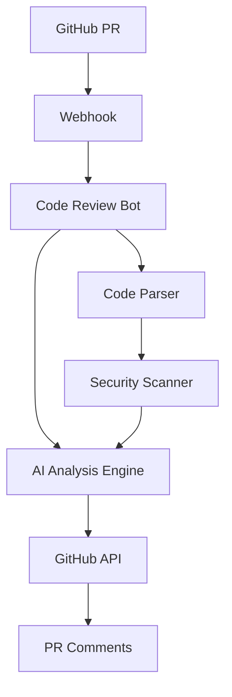

# Building an AI-Powered Code Review Bot: Complete Implementation Guide

Automated code reviews can significantly improve code quality while reducing the burden on human reviewers. In this comprehensive guide, we'll build an AI-powered code review bot that integrates with GitHub and provides intelligent feedback.

## Project Overview

Our AI Code Review Bot will:
- Monitor GitHub pull requests automatically
- Analyze code changes using AI models
- Provide contextual feedback and suggestions
- Generate security and performance insights
- Integrate seamlessly with existing workflows

## Prerequisites

- Node.js 18+ and npm
- GitHub account with repository access
- OpenAI or Anthropic API key
- Basic understanding of webhooks
- Familiarity with GitHub API

## System Architecture



## Initial Setup

### 1. Project Initialization

```bash
mkdir ai-code-review-bot
cd ai-code-review-bot
npm init -y

# Install dependencies
npm install express
npm install @octokit/rest
npm install openai
npm install crypto
npm install dotenv
npm install typescript @types/node
npm install -D nodemon ts-node
```

### 2. Environment Configuration

Create `.env` file:

```env
# GitHub Configuration
GITHUB_TOKEN=ghp_your_github_token
GITHUB_WEBHOOK_SECRET=your_webhook_secret

# AI API Configuration
OPENAI_API_KEY=your_openai_key
ANTHROPIC_API_KEY=your_anthropic_key

# Server Configuration
PORT=3000
NODE_ENV=development

# Analysis Settings
MAX_FILES_PER_PR=10
MAX_FILE_SIZE=50000
```

### 3. TypeScript Configuration

Create `tsconfig.json`:

```json
{
  "compilerOptions": {
    "target": "ES2020",
    "module": "commonjs",
    "outDir": "./dist",
    "rootDir": "./src",
    "strict": true,
    "esModuleInterop": true,
    "skipLibCheck": true,
    "forceConsistentCasingInFileNames": true,
    "resolveJsonModule": true
  },
  "include": ["src/**/*"],
  "exclude": ["node_modules", "dist"]
}
```

## Core Implementation

### 1. GitHub Webhook Handler

```typescript
// src/webhook.ts
import express from 'express';
import crypto from 'crypto';
import { Octokit } from '@octokit/rest';
import { CodeReviewService } from './services/CodeReviewService';

export class WebhookHandler {
  private app: express.Application;
  private octokit: Octokit;
  private reviewService: CodeReviewService;

  constructor() {
    this.app = express();
    this.octokit = new Octokit({
      auth: process.env.GITHUB_TOKEN,
    });
    this.reviewService = new CodeReviewService(this.octokit);
    
    this.setupMiddleware();
    this.setupRoutes();
  }

  private setupMiddleware() {
    this.app.use(express.raw({ type: 'application/json' }));
  }

  private setupRoutes() {
    this.app.post('/webhook', this.handleWebhook.bind(this));
    this.app.get('/health', (req, res) => res.json({ status: 'healthy' }));
  }

  private verifySignature(payload: Buffer, signature: string): boolean {
    const expectedSignature = crypto
      .createHmac('sha256', process.env.GITHUB_WEBHOOK_SECRET!)
      .update(payload)
      .digest('hex');

    return crypto.timingSafeEqual(
      Buffer.from(`sha256=${expectedSignature}`),
      Buffer.from(signature)
    );
  }

  private async handleWebhook(req: express.Request, res: express.Response) {
    const signature = req.headers['x-hub-signature-256'] as string;
    
    if (!this.verifySignature(req.body, signature)) {
      return res.status(401).json({ error: 'Invalid signature' });
    }

    const event = req.headers['x-github-event'] as string;
    const payload = JSON.parse(req.body.toString());

    try {
      if (event === 'pull_request' && payload.action === 'opened') {
        await this.handlePullRequestOpened(payload);
      } else if (event === 'pull_request' && payload.action === 'synchronize') {
        await this.handlePullRequestUpdated(payload);
      }

      res.status(200).json({ message: 'Webhook processed successfully' });
    } catch (error) {
      console.error('Webhook processing error:', error);
      res.status(500).json({ error: 'Internal server error' });
    }
  }

  private async handlePullRequestOpened(payload: any) {
    const { repository, pull_request } = payload;
    
    console.log(`New PR opened: ${repository.full_name}#${pull_request.number}`);
    
    await this.reviewService.reviewPullRequest({
      owner: repository.owner.login,
      repo: repository.name,
      pullNumber: pull_request.number,
    });
  }

  private async handlePullRequestUpdated(payload: any) {
    const { repository, pull_request } = payload;
    
    console.log(`PR updated: ${repository.full_name}#${pull_request.number}`);
    
    await this.reviewService.reviewPullRequest({
      owner: repository.owner.login,
      repo: repository.name,
      pullNumber: pull_request.number,
    });
  }

  public start(port: number = 3000) {
    this.app.listen(port, () => {
      console.log(`Webhook server running on port ${port}`);
    });
  }
}
```

### 2. Code Review Service

```typescript
// src/services/CodeReviewService.ts
import { Octokit } from '@octokit/rest';
import { AIAnalyzer } from './AIAnalyzer';
import { CodeParser } from './CodeParser';

interface ReviewRequest {
  owner: string;
  repo: string;
  pullNumber: number;
}

interface FileAnalysis {
  filename: string;
  language: string;
  additions: number;
  deletions: number;
  patch: string;
  issues: ReviewIssue[];
}

interface ReviewIssue {
  type: 'error' | 'warning' | 'suggestion';
  line: number;
  message: string;
  suggestion?: string;
}

export class CodeReviewService {
  private aiAnalyzer: AIAnalyzer;
  private codeParser: CodeParser;

  constructor(private octokit: Octokit) {
    this.aiAnalyzer = new AIAnalyzer();
    this.codeParser = new CodeParser();
  }

  async reviewPullRequest(request: ReviewRequest) {
    try {
      // Get PR files
      const files = await this.getPullRequestFiles(request);
      
      // Filter reviewable files
      const reviewableFiles = this.filterReviewableFiles(files);
      
      if (reviewableFiles.length === 0) {
        await this.postComment(request, 'No reviewable code changes found.');
        return;
      }

      // Analyze each file
      const analyses: FileAnalysis[] = [];
      
      for (const file of reviewableFiles) {
        const analysis = await this.analyzeFile(file);
        if (analysis.issues.length > 0) {
          analyses.push(analysis);
        }
      }

      // Generate and post review
      await this.postReview(request, analyses);
      
    } catch (error) {
      console.error('Error reviewing PR:', error);
      await this.postComment(request, '❌ Code review failed due to an internal error.');
    }
  }

  private async getPullRequestFiles(request: ReviewRequest) {
    const { data: files } = await this.octokit.rest.pulls.listFiles({
      owner: request.owner,
      repo: request.repo,
      pull_number: request.pullNumber,
    });

    return files;
  }

  private filterReviewableFiles(files: any[]) {
    const maxFiles = parseInt(process.env.MAX_FILES_PER_PR || '10');
    const maxFileSize = parseInt(process.env.MAX_FILE_SIZE || '50000');

    return files
      .filter(file => {
        // Skip deleted files
        if (file.status === 'removed') return false;
        
        // Skip binary files
        if (file.filename.match(/\.(jpg|jpeg|png|gif|pdf|zip|exe)$/i)) return false;
        
        // Skip large files
        if (file.changes > maxFileSize) return false;
        
        // Only review code files
        return this.codeParser.isCodeFile(file.filename);
      })
      .slice(0, maxFiles);
  }

  private async analyzeFile(file: any): Promise<FileAnalysis> {
    const language = this.codeParser.detectLanguage(file.filename);
    
    // Parse the patch to get changed lines
    const changedLines = this.codeParser.parseChangedLines(file.patch);
    
    // Analyze with AI
    const issues = await this.aiAnalyzer.analyzeCode({
      filename: file.filename,
      language,
      patch: file.patch,
      changedLines,
    });

    return {
      filename: file.filename,
      language,
      additions: file.additions,
      deletions: file.deletions,
      patch: file.patch,
      issues,
    };
  }

  private async postReview(request: ReviewRequest, analyses: FileAnalysis[]) {
    if (analyses.length === 0) {
      await this.postComment(request, '✅ No issues found in this pull request.');
      return;
    }

    // Generate review comments
    const comments = this.generateReviewComments(analyses);
    
    // Generate summary
    const summary = this.generateReviewSummary(analyses);

    // Post review with comments
    await this.octokit.rest.pulls.createReview({
      owner: request.owner,
      repo: request.repo,
      pull_number: request.pullNumber,
      body: summary,
      event: 'COMMENT',
      comments: comments.map(comment => ({
        path: comment.path,
        line: comment.line,
        body: comment.body,
      })),
    });
  }

  private generateReviewComments(analyses: FileAnalysis[]) {
    const comments: Array<{ path: string; line: number; body: string }> = [];

    for (const analysis of analyses) {
      for (const issue of analysis.issues) {
        const emoji = this.getIssueEmoji(issue.type);
        let body = `${emoji} **${issue.type.toUpperCase()}**: ${issue.message}`;
        
        if (issue.suggestion) {
          body += `\n\n**Suggestion:**\n\`\`\`${analysis.language}\n${issue.suggestion}\n\`\`\``;
        }

        comments.push({
          path: analysis.filename,
          line: issue.line,
          body,
        });
      }
    }

    return comments;
  }

  private generateReviewSummary(analyses: FileAnalysis[]): string {
    const totalIssues = analyses.reduce((sum, analysis) => sum + analysis.issues.length, 0);
    const errorCount = analyses.reduce(
      (sum, analysis) => sum + analysis.issues.filter(issue => issue.type === 'error').length,
      0
    );
    const warningCount = analyses.reduce(
      (sum, analysis) => sum + analysis.issues.filter(issue => issue.type === 'warning').length,
      0
    );
    const suggestionCount = totalIssues - errorCount - warningCount;

    let summary = '## 🤖 AI Code Review\n\n';
    summary += `**Summary**: Found ${totalIssues} issue(s) across ${analyses.length} file(s)\n\n`;
    
    if (errorCount > 0) summary += `🚨 **${errorCount}** error(s)\n`;
    if (warningCount > 0) summary += `⚠️ **${warningCount}** warning(s)\n`;
    if (suggestionCount > 0) summary += `💡 **${suggestionCount}** suggestion(s)\n`;

    summary += '\n### Files Analyzed:\n';
    for (const analysis of analyses) {
      const issueText = analysis.issues.length === 1 ? 'issue' : 'issues';
      summary += `- \`${analysis.filename}\` (${analysis.issues.length} ${issueText})\n`;
    }

    summary += '\n---\n*This review was generated by AI4Dev Code Review Bot*';
    
    return summary;
  }

  private getIssueEmoji(type: string): string {
    switch (type) {
      case 'error': return '🚨';
      case 'warning': return '⚠️';
      case 'suggestion': return '💡';
      default: return '📝';
    }
  }

  private async postComment(request: ReviewRequest, message: string) {
    await this.octokit.rest.issues.createComment({
      owner: request.owner,
      repo: request.repo,
      issue_number: request.pullNumber,
      body: message,
    });
  }
}
```

### 3. AI Analysis Engine

```typescript
// src/services/AIAnalyzer.ts
import OpenAI from 'openai';

interface AnalysisRequest {
  filename: string;
  language: string;
  patch: string;
  changedLines: number[];
}

export class AIAnalyzer {
  private openai: OpenAI;

  constructor() {
    this.openai = new OpenAI({
      apiKey: process.env.OPENAI_API_KEY,
    });
  }

  async analyzeCode(request: AnalysisRequest): Promise<ReviewIssue[]> {
    const prompt = this.buildAnalysisPrompt(request);
    
    try {
      const response = await this.openai.chat.completions.create({
        model: 'gpt-4',
        messages: [
          {
            role: 'system',
            content: this.getSystemPrompt(),
          },
          {
            role: 'user',
            content: prompt,
          },
        ],
        max_tokens: 2000,
        temperature: 0.1,
      });

      const content = response.choices[0].message.content || '';
      return this.parseAIResponse(content);
      
    } catch (error) {
      console.error('AI analysis error:', error);
      return [];
    }
  }

  private getSystemPrompt(): string {
    return `
You are an expert code reviewer with deep knowledge of software engineering best practices, 
security vulnerabilities, and performance optimization. 

Analyze the provided code changes and identify:
1. Potential bugs or logical errors
2. Security vulnerabilities 
3. Performance issues
4. Code quality improvements
5. Best practice violations

Respond with a JSON array of issues in this exact format:
[
  {
    "type": "error|warning|suggestion",
    "line": line_number,
    "message": "Clear description of the issue",
    "suggestion": "Optional code suggestion"
  }
]

Focus only on the changed lines and their immediate context.
Be concise but specific in your feedback.
    `.trim();
  }

  private buildAnalysisPrompt(request: AnalysisRequest): string {
    return `
Please review this ${request.language} code change in file: ${request.filename}

Git patch:
\`\`\`diff
${request.patch}
\`\`\`

Changed lines: ${request.changedLines.join(', ')}

Please analyze for potential issues, focusing on:
- Security vulnerabilities
- Performance problems  
- Bug potential
- Code quality
- Best practices

Return your findings as a JSON array.
    `.trim();
  }

  private parseAIResponse(response: string): ReviewIssue[] {
    try {
      // Extract JSON from response (handle cases where AI adds extra text)
      const jsonMatch = response.match(/\[[\s\S]*\]/);
      if (!jsonMatch) return [];

      const issues = JSON.parse(jsonMatch[0]);
      
      // Validate and sanitize issues
      return issues
        .filter((issue: any) => 
          issue.type && 
          issue.line && 
          issue.message &&
          ['error', 'warning', 'suggestion'].includes(issue.type)
        )
        .map((issue: any) => ({
          type: issue.type,
          line: parseInt(issue.line),
          message: issue.message.substring(0, 500), // Limit length
          suggestion: issue.suggestion?.substring(0, 1000), // Limit length
        }));
        
    } catch (error) {
      console.error('Failed to parse AI response:', error);
      return [];
    }
  }
}
```

### 4. Code Parser Utility

```typescript
// src/services/CodeParser.ts
export class CodeParser {
  private readonly codeExtensions = new Set([
    '.js', '.ts', '.jsx', '.tsx', '.py', '.java', '.c', '.cpp', '.cs',
    '.php', '.rb', '.go', '.rs', '.swift', '.kt', '.scala', '.r',
    '.sql', '.html', '.css', '.scss', '.less', '.vue', '.svelte'
  ]);

  private readonly languageMap: Record<string, string> = {
    '.js': 'javascript',
    '.jsx': 'javascript',
    '.ts': 'typescript',
    '.tsx': 'typescript',
    '.py': 'python',
    '.java': 'java',
    '.c': 'c',
    '.cpp': 'cpp',
    '.cs': 'csharp',
    '.php': 'php',
    '.rb': 'ruby',
    '.go': 'go',
    '.rs': 'rust',
    '.swift': 'swift',
    '.kt': 'kotlin',
    '.scala': 'scala',
    '.r': 'r',
    '.sql': 'sql',
    '.html': 'html',
    '.css': 'css',
    '.scss': 'scss',
    '.vue': 'vue',
    '.svelte': 'svelte',
  };

  isCodeFile(filename: string): boolean {
    const extension = this.getFileExtension(filename);
    return this.codeExtensions.has(extension);
  }

  detectLanguage(filename: string): string {
    const extension = this.getFileExtension(filename);
    return this.languageMap[extension] || 'text';
  }

  parseChangedLines(patch: string): number[] {
    const lines: number[] = [];
    const patchLines = patch.split('\n');
    
    let currentLine = 0;
    
    for (const line of patchLines) {
      if (line.startsWith('@@')) {
        const match = line.match(/@@ -\d+,?\d* \+(\d+),?\d* @@/);
        if (match) {
          currentLine = parseInt(match[1]) - 1;
        }
      } else if (line.startsWith('+') && !line.startsWith('+++')) {
        currentLine++;
        lines.push(currentLine);
      } else if (line.startsWith(' ')) {
        currentLine++;
      }
    }
    
    return lines;
  }

  private getFileExtension(filename: string): string {
    const lastDot = filename.lastIndexOf('.');
    return lastDot === -1 ? '' : filename.substring(lastDot).toLowerCase();
  }
}
```

## Deployment Setup

### 1. Docker Configuration

Create `Dockerfile`:

```dockerfile
FROM node:18-alpine

WORKDIR /app

COPY package*.json ./
RUN npm ci --only=production

COPY dist/ ./dist/
COPY .env ./

EXPOSE 3000

CMD ["node", "dist/index.js"]
```

### 2. GitHub App Setup

Create a GitHub App with these permissions:
- Repository permissions: Contents (read), Pull requests (write), Issues (write)
- Subscribe to events: Pull request

### 3. Environment Setup

For production, use environment variables:

```bash
# Set up environment variables
export GITHUB_TOKEN="your_github_token"
export GITHUB_WEBHOOK_SECRET="your_webhook_secret"
export OPENAI_API_KEY="your_openai_key"
```

## Testing the Bot

### 1. Unit Tests

```typescript
// tests/CodeReviewService.test.ts
import { CodeReviewService } from '../src/services/CodeReviewService';

describe('CodeReviewService', () => {
  it('should filter reviewable files correctly', () => {
    const files = [
      { filename: 'test.js', status: 'modified', changes: 100 },
      { filename: 'image.png', status: 'added', changes: 1000 },
      { filename: 'large.js', status: 'modified', changes: 100000 }
    ];

    const service = new CodeReviewService(mockOctokit);
    const reviewable = service['filterReviewableFiles'](files);
    
    expect(reviewable).toHaveLength(1);
    expect(reviewable[0].filename).toBe('test.js');
  });
});
```

### 2. Integration Testing

Create test PRs with known issues:

```javascript
// Example code with intentional issues for testing
function unsafeFunction(userInput) {
  eval(userInput); // Security issue - should be flagged
  return userInput;
}

const password = "hardcoded123"; // Security issue - should be flagged

// Performance issue - should be flagged  
for (let i = 0; i < array.length; i++) {
  for (let j = 0; j < array.length; j++) {
    // O(n²) complexity
  }
}
```

## Advanced Features

### 1. Custom Rules Engine

```typescript
// src/services/CustomRulesEngine.ts
interface CustomRule {
  name: string;
  pattern: RegExp;
  message: string;
  type: 'error' | 'warning' | 'suggestion';
  languages: string[];
}

export class CustomRulesEngine {
  private rules: CustomRule[] = [
    {
      name: 'no-console-log',
      pattern: /console\.log\(/g,
      message: 'Remove console.log statements before production',
      type: 'warning',
      languages: ['javascript', 'typescript'],
    },
    {
      name: 'sql-injection-risk',
      pattern: /\$\{.*\}.*query|query.*\$\{.*\}/gi,
      message: 'Potential SQL injection vulnerability - use parameterized queries',
      type: 'error',
      languages: ['javascript', 'typescript'],
    },
  ];

  analyzeWithCustomRules(code: string, language: string): ReviewIssue[] {
    const issues: ReviewIssue[] = [];
    const lines = code.split('\n');

    for (const rule of this.rules) {
      if (!rule.languages.includes(language)) continue;

      lines.forEach((line, index) => {
        if (rule.pattern.test(line)) {
          issues.push({
            type: rule.type,
            line: index + 1,
            message: rule.message,
          });
        }
      });
    }

    return issues;
  }
}
```

### 2. Performance Metrics

```typescript
// src/services/MetricsCollector.ts
export class MetricsCollector {
  private static metrics = {
    reviewsProcessed: 0,
    averageProcessingTime: 0,
    issuesFound: 0,
    falsePositiveRate: 0,
  };

  static recordReview(processingTime: number, issueCount: number) {
    this.metrics.reviewsProcessed++;
    this.metrics.issuesFound += issueCount;
    
    // Update average processing time
    this.metrics.averageProcessingTime = 
      (this.metrics.averageProcessingTime * (this.metrics.reviewsProcessed - 1) + processingTime) 
      / this.metrics.reviewsProcessed;
  }

  static getMetrics() {
    return { ...this.metrics };
  }
}
```

## Best Practices

### 1. Rate Limiting

```typescript
// src/utils/RateLimiter.ts
export class RateLimiter {
  private tokens: number;
  private lastRefill: number;

  constructor(
    private maxTokens: number,
    private refillRate: number // tokens per second
  ) {
    this.tokens = maxTokens;
    this.lastRefill = Date.now();
  }

  async acquire(): Promise<boolean> {
    this.refill();
    
    if (this.tokens > 0) {
      this.tokens--;
      return true;
    }
    
    return false;
  }

  private refill() {
    const now = Date.now();
    const timePassed = (now - this.lastRefill) / 1000;
    const tokensToAdd = Math.floor(timePassed * this.refillRate);
    
    this.tokens = Math.min(this.maxTokens, this.tokens + tokensToAdd);
    this.lastRefill = now;
  }
}
```

### 2. Error Recovery

```typescript
// src/utils/RetryHandler.ts
export async function withRetry<T>(
  fn: () => Promise<T>,
  maxRetries: number = 3,
  delay: number = 1000
): Promise<T> {
  for (let attempt = 1; attempt <= maxRetries; attempt++) {
    try {
      return await fn();
    } catch (error) {
      if (attempt === maxRetries) throw error;
      
      console.warn(`Attempt ${attempt} failed, retrying in ${delay}ms`);
      await new Promise(resolve => setTimeout(resolve, delay));
      delay *= 2; // Exponential backoff
    }
  }
  
  throw new Error('Max retries exceeded');
}
```

## Conclusion

This AI-powered code review bot provides:

- **Automated code analysis** using advanced AI models
- **GitHub integration** with seamless PR workflows  
- **Customizable rules** for team-specific requirements
- **Production-ready architecture** with proper error handling
- **Scalable design** supporting multiple repositories

The bot helps maintain code quality while reducing manual review overhead, allowing teams to focus on higher-level architectural decisions and complex logic review.

Continue enhancing the bot by adding features like:
- Support for more AI providers
- Advanced security scanning
- Code complexity analysis  
- Integration with CI/CD pipelines
- Custom reporting and analytics